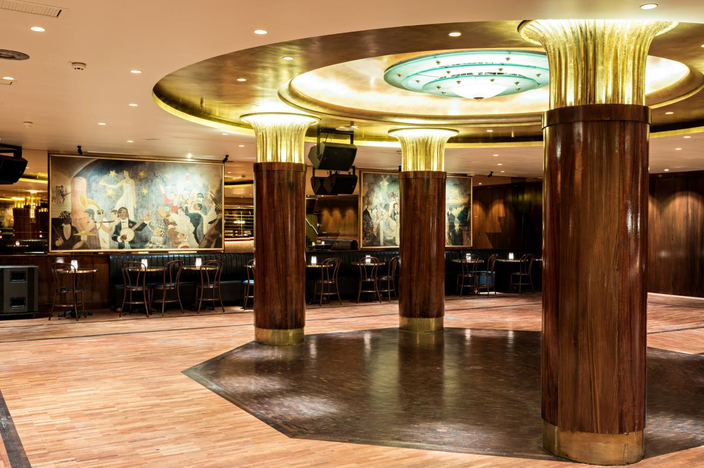

## Following the conference online

All sessions will be broadcast online using the zoom platform. Links will be made available in the program page. If you are presenting online, we suggest you get in touch with your session chair a bit in advance.

## Registration

All presenters have until May 10th to buy a registration ticket on ➡️[eventbrite](https://www.eventbrite.com/e/t2m-conference-paris-tickets-625202807427)⬅️.

Invited speakers are not required to do so and will receive a special link to register.

Program including all confirmed speakers will be published shortly after.

## Dates

Conference will start to welcome participants on June 1st at 8:30.

It will close on June 2nd at 6:30.

## Venue

The conference will take place in the ESCP building close to Montparnasse:

*3 Rue Armand Moisant, 75015 Paris*

<iframe src="https://www.google.com/maps/embed?pb=!1m18!1m12!1m3!1d2625.822156632339!2d2.314878176015093!3d48.84253087132997!2m3!1f0!2f0!3f0!3m2!1i1024!2i768!4f13.1!3m3!1m2!1s0x47e670339b680e2f%3A0x52e665ec20f7585e!2sESCP%20Business%20School%20Paris%20Campus%20%2F%20Montparnasse!5e0!3m2!1sfr!2sfr!4v1682628667982!5m2!1sfr!2sfr" width="600" height="450" style="border:0;" allowfullscreen="" loading="lazy" referrerpolicy="no-referrer-when-downgrade"></iframe>

A list of nearby hotels can be downloaded [here]().

## Dinner

A cocktail dinner with all conference participants will take place on Thursday evening at [La Coupole](https://www.lacoupole-paris.com/)

*102 Bd du Montparnasse, 75014 Paris*

It is a 15 min walk from where the school is located.
